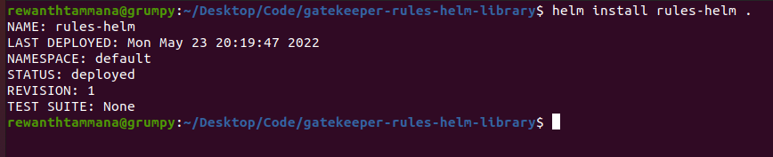
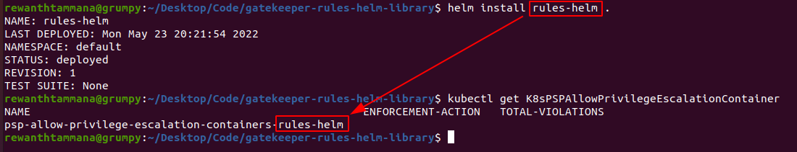

# OPA Gatekeeper Rules Helm Library

A library of policies for [OPA Gatekeeper project](https://open-policy-agent.github.io/gatekeeper/website/docs/) re-configured with [helm](https://helm.sh/) support.

## Installation

### Pre-requisites

* [OPA Gatekeeper](https://open-policy-agent.github.io/gatekeeper/website/docs/install/)
* [Helm 3](https://helm.sh/docs/intro/install/)
* Kubernetes installation

### Create CRDs

The crds are available in `./crds` folder.

```bash
kubectl create -f ./crds/general/
kubectl create -f ./crds/pod-security-policy/
```

### Install CRDs & templates

The `values.yaml` can be tweaked according to your use.

```bash
helm install rules-helm .
```



## Usage

All the templates are created in the format of `$TEMPLATENAME-$HELMRELEASENAME`. This kind of naming convention allows you to deploy templates with different values without hassle.



### Values.yaml

Edit the `values.yaml` file to pick the resources of your choice & customize them with ease.

## Authors

[Rewanth Tammana](https://www.linkedin.com/in/rewanthtammana/)

[Siddharth Tanna](https://www.linkedin.com/in/siddharthtanna/)
